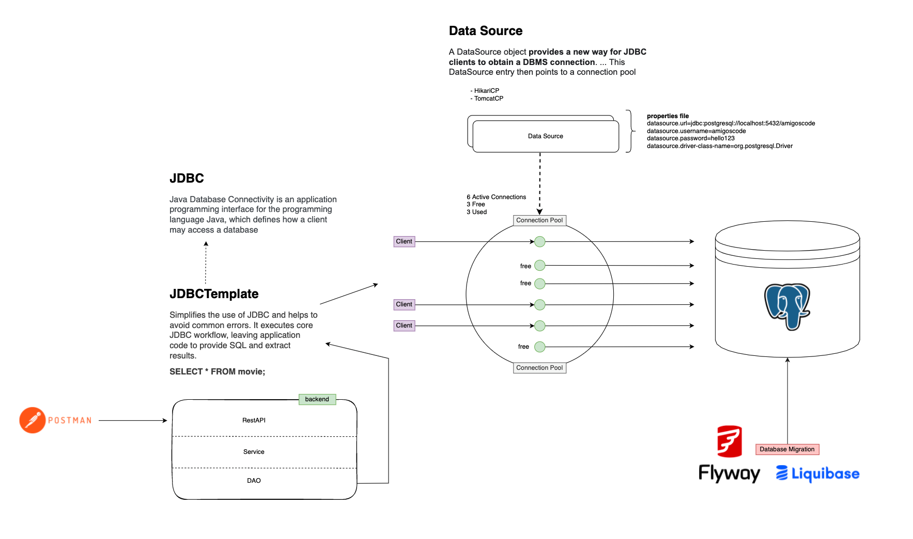

# JDBC-Course

## Description
This project demonstrates how to use JDBC (Java Database Connectivity) to connect to a PostgreSQL database, execute SQL queries, and retrieve results.

## Features
- Connect to a PostgreSQL database using JDBC.
- Execute SQL queries.
- Retrieve and display query results.

## Prerequisites
- Java Development Kit (JDK) installed.
- PostgreSQL database set up and running.
- JDBC driver for PostgreSQL.

